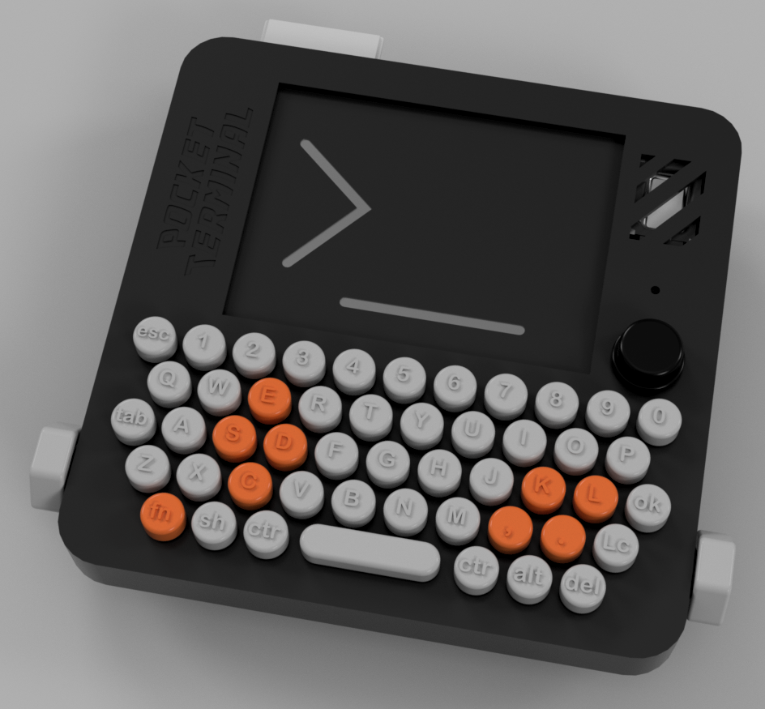

# Pocket_Terminal_Project

## "Una consola para aprender a programar e interactuar con sensores, todo en el mismo lugar"

## Descripción del Proyecto

Pocket Terminal es una consola portátil diseñada para enseñar programación y la interacción con el terminal de un sistema operativo. En un mundo donde las herramientas modernas y los LLMs facilitan la programación, Pocket Terminal ofrece un enfoque más directo y fundamental para comprender los conceptos básicos de la computación.

Este dispositivo permite a los usuarios:
- Escribir y ejecutar programas
- Interactuar con un terminal real
- Conectar y programar sensores
- Experimentar con hardware sin distracciones

## Motivación

Con los años, hemos visto que existe siempre mucho entusiasmo por proyectos como este en internet. Las comunidades que se forman alrededor de estos dispositivos comparten una energía creativa que fomenta el aprendizaje y la experimentación.

La clave para aprender algo nuevo está en **desafiarse**, y Pocket Terminal proporciona ese desafío en un formato accesible para todos: desde estudiantes en colegios y universidades, hasta adultos y niños interesados en la tecnología.

## Estado del Proyecto

Actualmente, Pocket Terminal se encuentra en fase de desarrollo. Este repositorio contiene:
- Diseños preliminares
- Esquemas de hardware
- Código fuente del sistema operativo básico
- Documentación del proyecto

## Características Planificadas

- Sistema operativo basado en Linux
- Matriz de teclado QWERTY completo
- Pantalla compacta pero funcional (2.8" 320x240 pixeles)
- Puerto para cartuchos programables
- Sistema de expansión para sensores
- Batería recargable

## Contribuciones

[Por definir...]

## Licencia

[Por definir...]

