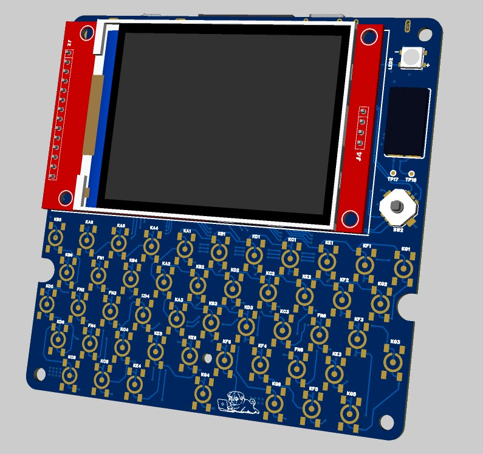

# Project Bit-0

## "Una consola para aprender a programar e interactuar con sensores, todo en el mismo lugar"

<p align="center">
  
  
</p>

## Descripción del Proyecto

Una computadora interactiva y asequible para enseñar programación, sistemas operativos y electrónica embebida. Respaldada por una comunidad de enseñanza y desarrollo de código abierto para hacer estas experiencias divertidas, accesibles y atractivas.

## Objetivos

Diseñar y pilotar una experiencia educativa con una plataforma atractiva.

- Desafíos que enseñan los fundamentos sobre la resolución de problemas computacionales
- Introducir conceptos básicos de sistemas operativos en un entorno basado en Linux (el sistema de archivos y la terminal)
- Enseñar programación inicial (Python/Lua/C++)
- Desarrollar proyectos con sensores y actuadores
- El profesor como facilitador con materiales guía
- Una interfaz de usuario interactiva con un enfoque en la exploración de herramientas de código abierto

## Primer Prototipo

En colaboración con estudiantes de posgrado y pregrado de la Universidad de los Andes, Chile, y con el apoyo de Vitatronics Chile, estamos validando nuestro primer prototipo y desarrollando nuevas experiencias de enseñanza. Este prototipo es una pequeña computadora portátil diseñada específicamente para introducir los conceptos básicos de la interacción de software y hardware tanto dentro como fuera del aula.

## Hardware

La placa utiliza un microcontrolador RP2040 programable para manejar una matriz de teclado de 52 teclas, LED de estado, monitoreo de batería y ciclo de encendido seguro. Se conecta a través de I²C a nuestro sistema principal: una micro placa Linux Luckfox Lyra SBC disponible comercialmente con una pantalla SPI de 2.8" 320×240. El sistema ejecuta una imagen de Linux personalizada desde una tarjeta microSD flasheable, con expansión disponible a través de una segunda ranura SD de tamaño completo. La unidad también incluye un amplificador de audio/DAC, una batería recargable de iones de litio con carga USB-C y un arreglo GPIO de uso libre para sensores y actuadores.

## Software

En el lado del software, la placa ejecuta firmware de código abierto en el RP2040. El Luckfox utiliza una versión compilada personalizada de Buildroot Linux (basada en el [Luckfox Lyra SDK](https://wiki.luckfox.com/Luckfox-Lyra/SDK/) y Kernel 6.1) con controladores personalizados desarrollados para la pantalla, el teclado y el audio. Cuenta con compatibilidad con el motor Pico-8 Fantasy Console, lo que permite a los estudiantes desarrollar juegos interactivos utilizando un lenguaje de programación de alto nivel como Lua. Planeamos usar este software inicialmente para probar y validar nuestro piloto. Una interfaz personalizada basada en terminal está en nuestra hoja de ruta para el desarrollo futuro.

## Uso de la Consola

### Programación del Firmware (RP2040)

Para programar el microcontrolador RP2040 y modificar el firmware del teclado, es necesario poner el dispositivo en modo bootloader. Para esto:

1. Mantén presionado el switch **KB_BOOT**.
2. Conecta el cable USB-C al puerto de la consola.
3. El dispositivo aparecerá como una unidad de almacenamiento masivo (RPI-RP2) en tu computadora.
4. Arrastra y suelta el archivo `.uf2` del firmware en la unidad.

### Configuración del SDK (Luckfox Lyra)

El proyecto utiliza el SDK de Luckfox Lyra para construir la imagen del sistema operativo.

1.  **Obtener el SDK:**
    Sigue las instrucciones oficiales para descargar y configurar el SDK: [Luckfox Lyra SDK Wiki](https://wiki.luckfox.com/Luckfox-Lyra/SDK/).

2.  **Integrar Archivos del Proyecto:**
    La carpeta `buildroot/` de este repositorio contiene las configuraciones y drivers específicos para el Pocket Terminal (pantalla, teclado, audio). Estos archivos deben copiarse en la estructura del SDK para sobrescribir o complementar los archivos originales.
    *(Nota: La estructura de carpetas actual en `buildroot/` refleja una ruta absoluta de desarrollo. Asegúrate de copiar los archivos a las rutas correspondientes dentro de tu instalación del SDK).*

## Estructura del Repositorio

Este repositorio está organizado de la siguiente manera:

```
.
├── 3d files/           # Archivos de diseño 3D y modelos mecánicos
├── admin/              # Documentación de gestión del proyecto
├── assets/             # Recursos gráficos e imágenes
├── buildroot/          # Configuración y scripts para el sistema Linux (Luckfox Lyra)
├── keyboard_firmware/  # Código fuente del firmware del microcontrolador RP2040
├── pcb/                # Archivos de diseño electrónico y PCB
└── README.md           # Documentación general del proyecto
```

## Contribuciones

[Por definir...]

## Licencia

Este proyecto está bajo la Licencia MIT. Consulta el archivo [LICENSE](LICENSE) para más detalles.

